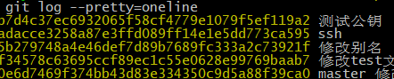

## git的基本用法

**1、git的安装**

官网链接地址 https://git-scm.com/downloads
点击下载下一步，就ok，成功安装之后window环境下，右击鼠标出现Git Gui和Git Bash,Gui是图形界面，Bash是linux命令行界面。使用bash即可。

**2、git的本地基本命令**

git clone 从远程代码仓库下载代码或文本信息到本地。

git clone xxx(https地址)

git init 在本机创建一个本地仓库，初始化。出现.git 文件，不可删改。

git add .  或 git add （a.html）某一个html文件，加入代码暂存区。

git commit -m "xxxx" -m代表message信息， "xxx"为修改代码的日志备注。
commit会将代码信息提交到本地的仓库。

**3、git 提交拉取远程仓库命令**

git push 推送到远程仓库

- 第一种用法：git push https://xxxxxx master ;master 为主支名。

- 第二种用法： git remote add origin https://xxxxxl; git remote给远程仓库起别名 origin可以为任意名字。

git push origin master 直接提交到远程代码 仓库，需在本地操作完成之后，方能将修改部分上传到远程仓库。

git pull origin master 从远程仓库拉取更新信息。

git remote -v 查看别名信息。

**4、git建立分支多人协作**

git branch 查看当前分支数量。

git branch aaa 创建分支，即从主干上备份一个一模一样的内容出去，但是不同于svn的粗暴复制，git 建立分支仅仅是创建一个主支的快照。

git checkout aaa 切换到分支aaa上，可以修改aaa的内容进行代码信息修改，不影响主支的内容

git merge aaa 切换到主支进行分支的合并，将aaa修改的代码，合并到主支上，从而完成多人协作。

**5、日志查看与版本切换**

git log 查看所有修改的日志，战线拉太长不利于查看。

git log --pretty=oneline 在一行内查看。

git reflog 查看所有版本变化日志记录

git reset --hard HEAD^^^^ 回退版本一个^代表一条记录。

git reset --hard xxxxx 通过每一条记录的hash值回退（xxx)可以简写头几位。

